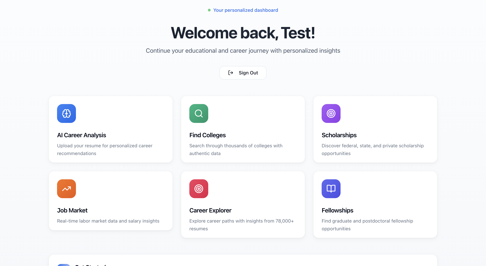
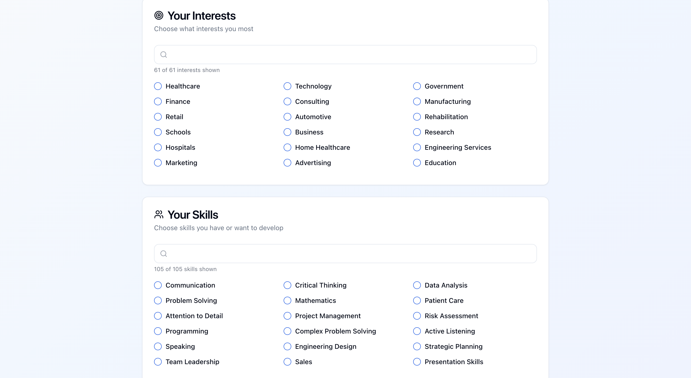
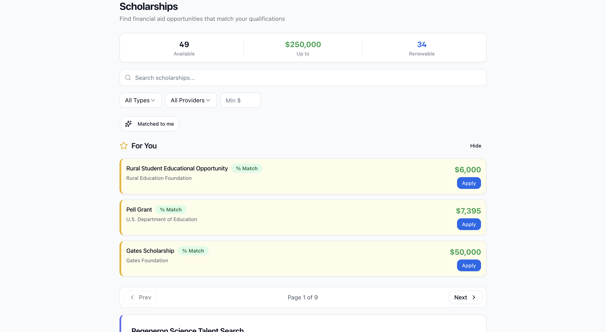
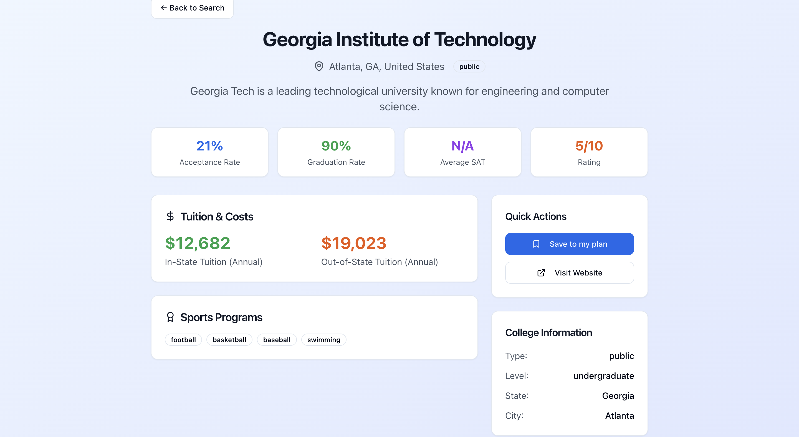
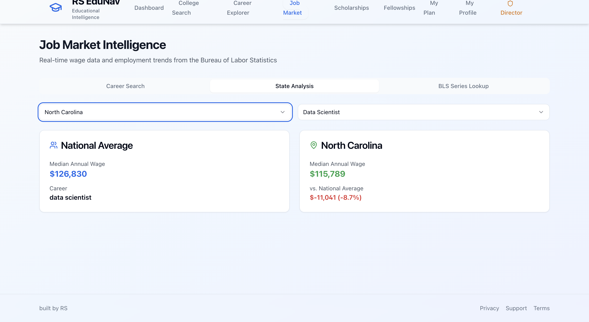
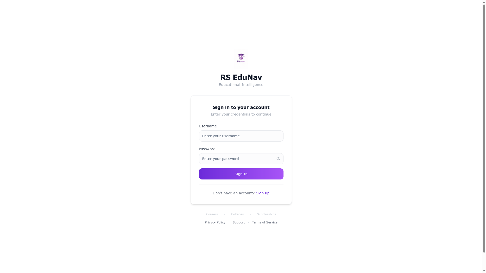

# RS EduNav

**AI-powered educational guidance for students.**

RS EduNav helps students navigate college, career, and scholarship decisions with personalized, AI-driven recommendations. Upload a resume, share your interests, and the platform surfaces career matches, fitting colleges, and scholarships you actually qualify for — all in one place.

🌐 **Live site:** [rsedunav.com](https://rsedunav.com)
📱 **Mobile app:** iOS & Android (built with Expo, in review for the App Store)

---

## Preview

### Your personalized dashboard


### Career Explorer — pick your interests and skills


### Scholarship matching


### College detail pages


### Real-time job market data


### Sign in


---

## What it does

- **🎯 Career matching** — Recommends careers based on your interests, skills, education, and resume. Uses a hybrid matching engine (taxonomy + keyword + fuzzy fallback) tuned on 76,000+ real resume patterns.
- **🎓 College discovery** — Search and explore detailed profiles for 36,000+ colleges including ratings, programs, and admissions stats.
- **💰 Scholarship engine** — Find, filter, sort, and save scholarships you qualify for. Includes 48+ curated scholarships and 18+ fellowships, with smart matching based on your profile.
- **📄 Resume analysis** — Upload your resume and the platform extracts skills, interests, GPA, and education indicators to personalize every recommendation.
- **📌 My Plan** — Save careers, colleges, and scholarships in one place to compare and track what you're considering.
- **📊 Job market insights** — Real wage data, demand trends, and outlook by career.
- **📱 Native mobile app** — Full experience on iOS and Android via Expo, with offline-friendly session caching.

---

## Tech stack

| Layer | Tools |
|---|---|
| **Web frontend** | React 18, Vite, Tailwind CSS, shadcn/ui, React Query |
| **Mobile app** | Expo / React Native, Expo Router, AsyncStorage |
| **Backend API** | Node.js 24, Express 5, Passport (local auth) |
| **Database** | PostgreSQL with Drizzle ORM |
| **AI / ML** | Anthropic Claude, OpenAI |
| **Validation** | Zod, drizzle-zod |
| **Monorepo** | pnpm workspaces, TypeScript everywhere |
| **Hosting** | Replit Deployments (autoscale) |

---

## Project structure

```
RSedunav/
├── artifacts/
│   ├── edunav/          → React web app
│   ├── edunav-mobile/   → Expo iOS + Android app
│   └── api-server/      → Express API backend
├── lib/                 → Shared TypeScript libraries
└── scripts/             → Utility scripts
```

---

## Status

- ✅ Web app live and in production at [rsedunav.com](https://rsedunav.com)
- ✅ Custom domain with SSL
- ✅ Mobile builds configured for iOS App Store and Google Play
- 🚧 iOS App Store submission in progress
- 🚧 Android Play Store submission in progress

---

## License

Private project. All rights reserved © RS Education.
